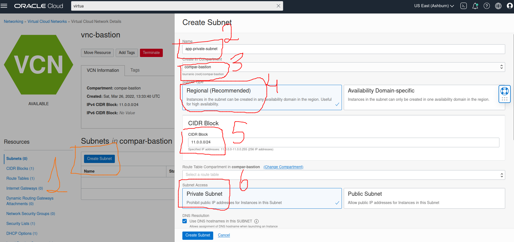
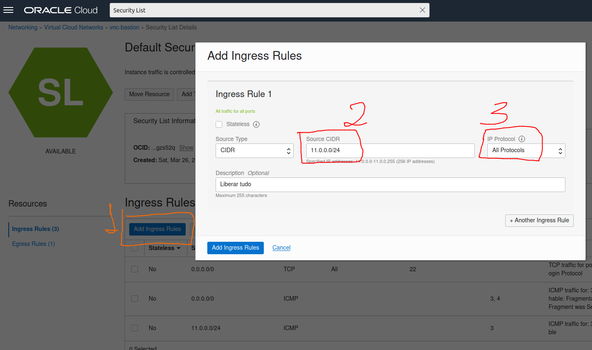
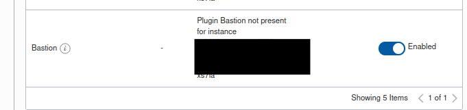
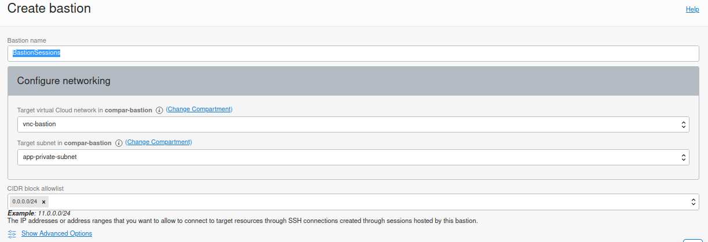
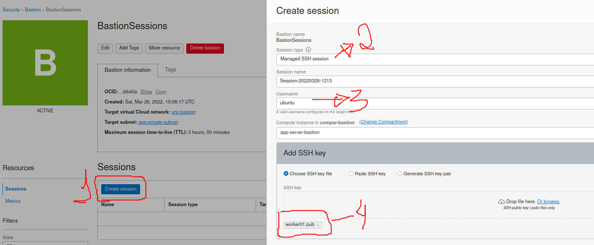
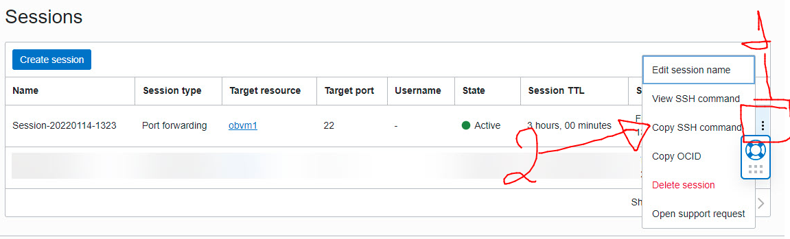
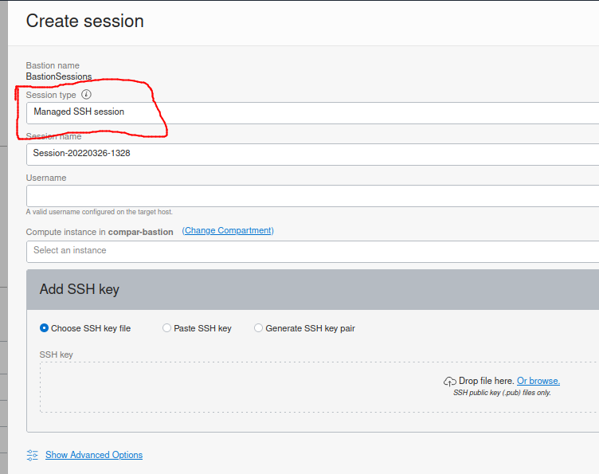
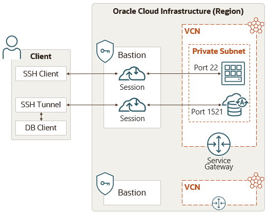

# Bastion OCI

## Sumário

- [About](#about)
- [Avisos](#avisos)
- [Conceitos](#conceitos)


## About <a name = "about"></a>

Como utilizar o Bastion da Oracle Cloud (OCI)

## Passo a Passo <a name = "passo-a-passo"></a>

1. Criar compartimento
    ```compar-bastion```
2. Criar uma VCN (Virtual Cloud Networks) no compartimento "compar-bastion" ```vnc-bastion```

    </a>


3. Entrar no "Networking > Virtual Cloud Networks > vnc-bastion > Security List Details" e add uma regra com permissao de tudo.
    - "Add Ingress Rules"

    </a>

4. Criar instancia APP SERVER BASTION.
    - IP PRIVADO
    - enable bastion

        </a>

    - 
5. Criar uma sessao do bastion (Security > Bastion). Canal de conexao.
```BastionSessions``` com ```CIDR block allowlist:
 0.0.0.0/0```

    </a>


6. Criar uma Session dentro do bastion criado.

    </a>

7. Copiar o comando ssh para acessar atraves da session do bastion criado.

``` 
ssh -i <chave-privada> -N -L <porta-local>:<ip-instancia>:22 -p 22 <url-oci-da-session-bastion>
```

.       </a>


## Avisos <a name = "avisos"></a>

1. A opção "Sessão SSH gerenciada" requer que o **plug-in Bastion** esteja ativado no nó da **Instancia**. 
    
    Os plug-ins são listados na guia "Oracle Cloud Agent" da instância de computação.

    </a>

    </a>

2. O bastion só funcionará com um banco de dados autônomo se tiver um endpoint privado. Infelizmente, não é possível configurar um endpoint privado em contas de **nível gratuito**. 

    Sem o endpoint privado, não temos acesso ao endereço IP privado, então agora há uma maneira de fazer referência ao nosso banco de dados autônomo do bastião.

## Conceitos do Bastion <a name = "conceitos"></a>


O Cliente se conecta a uma Sessão em um Bastion usando um Cliente SSH ou Túnel SSH. As duas Sessões se conectam a uma instância e a um banco de dados em uma Sub-rede Privada. A VCN que contém a Sub-rede Privada tem um Gateway de Serviço. [DOC. ORACLE](https://docs.oracle.com/pt-br/iaas/Content/Bastion/Concepts/bastionoverview.htm)


- </a>

