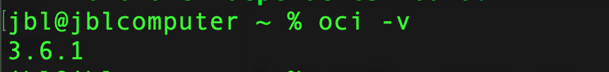

# COMO INSTALAR O CLI DO ORACLE CLOUD NO MAC OS.

## Instalacao <a name = "about"></a>

```
  brew update && brew install oci-cli

  oci -v

```

<p align="center">
  <a href="" rel="noopener">
 </a>
</p>


## Getting Started <a name = "getting_started"></a>

These instructions will get you a copy of the project up and running on your local machine for development and testing purposes. See [deployment](#deployment) for notes on how to deploy the project on a live system.

### Prerequisites

What things you need to install the software and how to install them.

```
Give examples
```

### Installing

A step by step series of examples that tell you how to get a development env running.

Say what the step will be

```
Give the example
```

And repeat

```
until finished
```

End with an example of getting some data out of the system or using it for a little demo.

## Usage <a name = "usage"></a>

Add notes about how to use the system.
